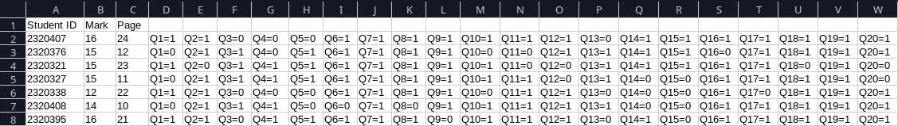

# QuickMark

## Project Overview
A Software is designed to automate the correction of bubble sheet exams for educational organizations. With a focus on efficiency, it significantly reduces the time and effort required for the correction process, empowers professors and teachers to allocate more time for more important tasks.

## Technologies Used
- **Core Language:** Python
- **Image Processing Libraries:** OpenCV, NumPy
- **Backend:** Python Flask
- **Frontend:** HTML, CSS, Vue.js (under development)

## Key Features
- **Error Handling:** Utilizes various techniques to address unclear sheets or non-correct shaded responses.
- **Low Error Rate:** Achieves an error rate of less than 0.5%.
- **Speed:** Rapidly corrects each sheet in about 200ms.
- **Analysis:** Provides insightful performance metrics for students after each exam.
- **Simplicity:** The correction process involves four straightforward steps: choose sheet model, upload model answer, upload sheets, download results, and analysis.

## Challenges and Solutions
Encountered challenges, including low performance and difficulties in error handling, were solved through continuous improvement and algorithm refinement.

## Project Structure
The project is organized into three main components:
1. **Core Program:** Manages the fundamental functionality of the correction process.
2. **Backend:** Implements server-side logic
3. **Frontend:** Currently under development

## Testing and Validation
- The software is currently in beta and serves as the primary program for correcting bubble sheet exams at **Borg Alarab Technological Unversity** (Alex, Egypt).

## Usage and Installation
- The software is not yet available for public usage as it is still in beta.
- For trying or more details, please contact me directly via email at [mostafamfelmasry@outlook.com].

## Output samples

  
here is a final output file sample provide a full info about the corrected sheet(s).

### columns explaination ###
 -  **student ID :** the id of the student  
 -  **Mark :** sum of corrected question in the exam  
 -  **Page :** i added this column for better exprience if the examiner wants to know where this sheet in the sheets file to manual review for example. imagine you want a sheet from file contains 500 sheet and you only have the student id, waste of time right?, for that reason i added this column  
 -  **Qx :** the answer of the student in the question number x, there is four possible result (`1` for true answer, `0` for false answer, `M` this appear if the student shade more than bubble and this treats a false answer, `Z` apear when the student shad 0 bubbles and this treats as false answer too)
  

  
This screenshot shows interactions with the backend with uploading `sheets.pdf` and get the result in `result.zip` through simple commands and clear feedback.

## Future Plans
- Web app development is currently underway.

